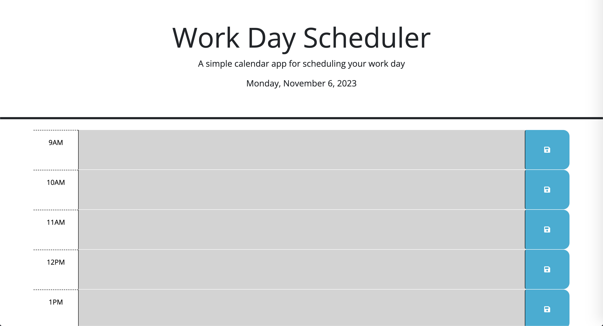

# <Workday Scheduler>

## Workday Schedueler

## Description

A simple workday scheduler that allows users to input their schedule for the day and save it to their local machine. The calendar displays the current day and will automatically update the timeslots to show past, present, and future events the user has scheduled throughout the day.

## Screenshots

## Usage

To use this web application you can follow this link to the page: 

Once the webpage has loaded, simply start typing out your schedule for the day. The application will show you the current day as well as the general time in the timeslots below. If a timeslot is greyed out it means that the time is past the current time, red means that it is the current time, and green indicates a future time. Using this users can easily schedule out their day and then save the events to their local machine in case they exit out of the application at any point.

## Credits 

N/A

## Liscense

[MIT](https://choosealicense.com/licenses/mit/)